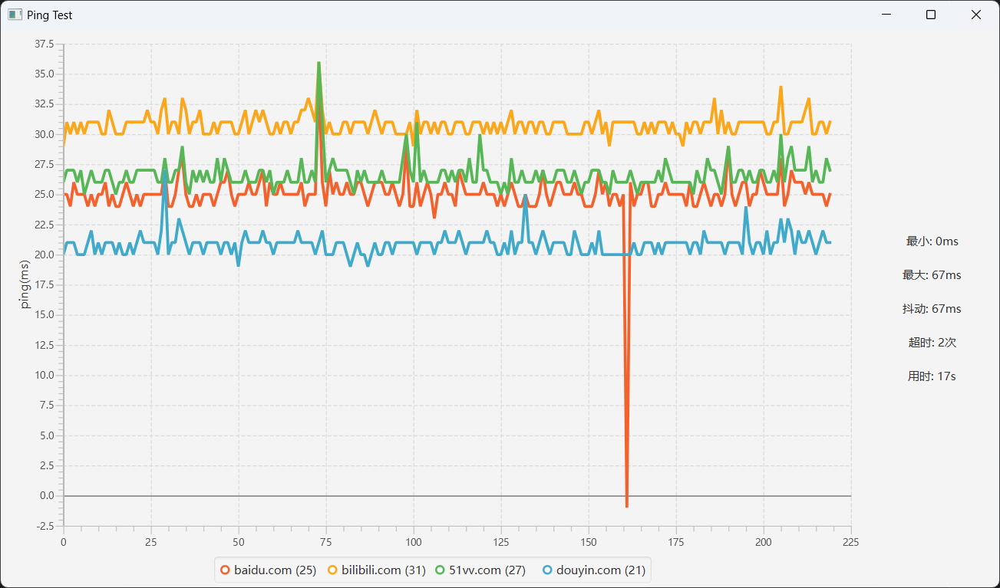

# PingTest - 延迟测试

此项目是为检测我家网络波动所诞生的。

## 配置说明 (config.json)

```json5
{
  //检测目标主机名 可以是 ipv4 或 主机名，ipv6好像不太彳亍
  "host": [
    "baidu.com",
    "bilibili.com",
    "51vv.com",
    "douyin.com",
    "192.168.1.1",
    "127.0.0.1",
    "zedo-pc"
  ],
  //图标显示最长监测点
  "length": 220,
  //指定超时时间 (ms)
  "timeout": 400,
  //检测速率 (n/s)
  "pingRate": 20.0
}
```

### 软件截图



